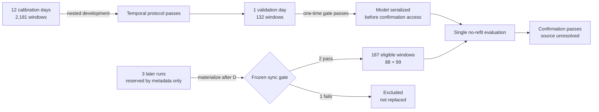
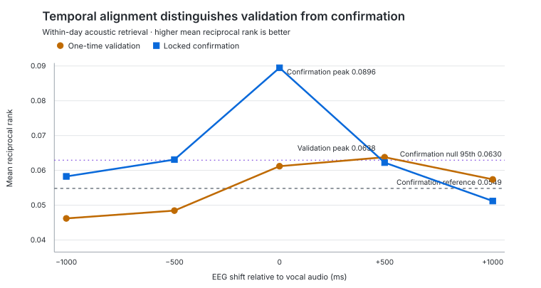

# Non-Invasive Speech Decoding

[](https://github.com/Shriya-sai/noninvasive-speech-decoding/actions/workflows/tests.yml)

**A locked, no-refit temporal EEG model replicated acoustic retrieval above
prespecified controls on two later recording days. The result establishes a
reproducible signal—not its cortical origin.**

This repository is an independent reproduction and mechanistic audit of
non-invasive open-vocabulary speech decoding using the public JapanEEG dataset.
It asks whether apparent decoding reflects stable cortical representations or
participant-, session-, device-, acoustic-, and articulation-specific signals.

## Results at a glance

| Stage | Data | Result | Decision |
|---|---|---|---|
| Linear baseline | Held-out days | EEG did not beat unseen-session or pairing controls | Diagnose the representation |
| Temporal development | 12 calibration days, 2,181 windows | Passed the frozen nested gate; MRR 0.0759 | Proceed once |
| One-time validation | 1 held-out day, 132 windows | Passed all criteria; MRR 0.0612 | Freeze and serialize model |
| Locked confirmation | 2 later days, 187 windows | Passed compound criterion; macro MRR **0.0896** vs reference **0.0549** | Audit signal source |
| Audio-envelope control | Validation | Dominant; MRR **0.8694** | Neural interpretation restricted |
| +500 ms EEG lag | Validation / confirmation | Above contemporaneous only in validation (0.0638 vs 0.0612); below it in confirmation (0.0622 vs 0.0896) | Timing evidence is mixed, then improves |

The locked confirmation used a checksum-pinned model, performed **zero fitted
operations**, and passed all preregistered checks: both days exceeded their
finite-candidate references, macro MRR exceeded the 99-permutation null 95th
percentile (0.0630; plus-one `p = 0.01`), and contemporaneous EEG exceeded time
reversal (0.0577). The effect was heterogeneous: day MRRs were 0.1202 and 0.0589.

## Protected data partitions



The reserved files were inaccessible during development and validation. Run
selection, synchronization, VAD, windowing, QC, tensors, model weights, and
decision rules were frozen or checksum-recorded before the relevant outcome.

## Temporal timing result



The validation +500 ms perturbation slightly exceeded contemporaneous EEG. In
locked confirmation, contemporaneous EEG exceeded every shift and reversal.
That improvement supports temporal specificity, but does not separate cortical
activity from speech-locked muscle or acoustic pathways.

## Control matrix

| Control family | What it tests | Observed result | Consequence |
|---|---|---|---|
| EEG held-out day | Session generalization | Static baseline null; temporal model confirms | Temporal structure matters |
| Audio envelope | Direct acoustic information | Vastly stronger than EEG on validation | Overt-speech acoustics remain a major confound |
| Session metadata | Candidate/session structure without EEG | Static EEG did not beat it | Metadata is a necessary baseline |
| Pairing permutations | Accidental EEG–target correspondence | Confirmation MRR 0.0896 > null 95th 0.0630 | Frozen pairing carries reproducible information |
| Time reversal | Dependence on temporal order | Confirmation reversal MRR 0.0577 | Correct order matters at confirmation |
| Circular lags | Alignment specificity | Mixed at validation; contemporaneous wins at confirmation | Timing evidence is supportive but not definitive |
| Artifact strata | Sensitivity to poor signal quality | Eligible confirmation days were clean-run strata | Confirmation is not driven by a flagged run |
| EMG / spatial source audit | Cortical versus peripheral origin | Not yet completed | Required before a neural representation claim |

## What this study can and cannot claim

| Supported now | Not supported now |
|---|---|
| A frozen temporal EEG feature model retrieves simultaneous vocal acoustics above prespecified controls on two later days for one participant. | The decoded signal is cortical, linguistic, semantic, or suitable for silent-speech communication. |
| The result survives protected confirmation with no refitting or run replacement. | More windows are independent biological replications; the independent unit is the recording day and ultimately the participant. |
| Correct temporal order is favored in confirmation. | Timing controls alone rule out facial EMG, movement, equipment coupling, or residual acoustic contamination. |
| Replicable decoding and cortical interpretation are empirically separable claims. | The present single-participant confirmation generalizes across people. |

## Study record

The core audit trail is deliberately explicit:

- [Project charter](docs/PROJECT_CHARTER.md) and [dataset provenance](docs/DATA_PROVENANCE.md)
- [Dataset audit](docs/PHASE0_DATASET_AUDIT.md), [synchronization/windowing](docs/SIGNAL_SYNCHRONIZATION_AND_WINDOWING.md), and [preprocessing](docs/PREPROCESSING_PILOT.md)
- [Multi-day QC calibration](docs/MULTIDAY_QC_CALIBRATION.md) and [baseline protocol](docs/BASELINE_MODELING_PROTOCOL.md)
- [Static ridge results](docs/RIDGE_BASELINE_RESULTS.md) and [calibration-day resampling](docs/CALIBRATION_DAY_RESAMPLING.md)
- [Frozen temporal protocol](docs/TEMPORAL_MODEL_PROTOCOL.md), [feature extraction](docs/TEMPORAL_FEATURE_EXTRACTION.md), and [development results](docs/TEMPORAL_DEVELOPMENT_RESULTS.md)
- [One-time validation](docs/TEMPORAL_VALIDATION_RESULTS.md) and [confirmation eligibility](docs/CONFIRMATION_ELIGIBILITY.md)
- [Confirmation feature checksum](docs/CONFIRMATION_FEATURE_EXTRACTION.md) and [locked confirmation result](docs/CONFIRMATION_RESULTS.md)
- [Decision log](docs/DECISION_LOG.md)

The project is anchored in Sato et al., *Scaling Law in Neural Data:
Non-Invasive Speech Decoding with 175 Hours of EEG Data* (2024), and the public
JapanEEG release described by Sato et al., *A 1000-hour EEG-EMG-audio dataset of
Japanese speech production* (2026).

## Next scientific gate

The next phase is a mechanistic source audit, not decoder escalation:

1. compare EEG with the simultaneously recorded facial EMG;
2. contrast peripheral and central EEG channel groups;
3. test physiologically constrained, non-circular lags;
4. quantify whether the confirmed effect survives removal of peripheral signal;
5. treat cross-participant analyses as exploratory until the participant count grows.

## Repository map

```text
configs/                 Frozen dataset and experiment specifications
data/                    Local data only; raw and derived data are ignored
docs/                    Charter, provenance, decisions, and result reports
figures/                 Versioned summary figures and ignored regenerable outputs
notebooks/               Exploration only; no confirmatory analysis
results/                 Regenerable outputs; ignored except for metadata
scripts/                 Thin executable entry points
src/japaneeg_audit/      Reusable analysis code
tests/                   Leakage, numerical, and construct-validity tests
upstream/                External code checkouts; ignored and pinned in configs
```

## Setup

```bash
python3.12 -m venv .venv
source .venv/bin/activate
python -m pip install -e '.[dev]'
pytest
```

No raw participant data, pretrained weights, credentials, or participant-level
generated results are committed to this repository.
